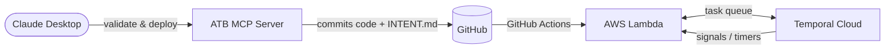
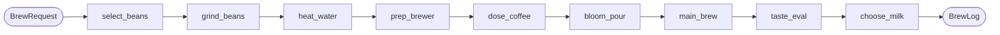

# Temporal Workflows

> Durable workflows built with [Temporal](https://temporal.io) and managed by [ATB](../temporal-ai) (Agentic Temporal Builder). Workers run on AWS Lambda connected to Temporal Cloud.

## System Architecture

## Deployed Workflows

| Name | Description | Trigger | Task Queue | Deployed | Intent |
|------|-------------|---------|------------|----------|--------|
| [hello-world](hello-world-fbb969/) | — | adhoc | `tq-hello-world-fbb969` | — | [INTENT.md](hello-world-fbb969/INTENT.md) |
| [perfect_cup_of_coffee](perfect_cup_of_coffee-83eb42/) | Guides a user through brewing a perfect cup of coffee, from bean selection to milk choice, producing a structured BrewLog. | adhoc | `tq-perfect_cup_of_coffee-83eb42` | 2026-05-09 | [INTENT.md](perfect_cup_of_coffee-83eb42/INTENT.md) |
| [simple-greeter](simple-greeter-324664/) | — | adhoc | `tq-simple-greeter-324664` | — | [INTENT.md](simple-greeter-324664/INTENT.md) |

## Workflow Details

### [hello-world](hello-world-fbb969/)

| | |
|---|---|
| **ID** | `hello-world-fbb969` |
| **Trigger** | adhoc |
| **Task Queue** | `tq-hello-world-fbb969` |
| **Integrations** | none |
| **Deployed** | — |

**Files:** [workflow.py](hello-world-fbb969/workflow.py) · [activities.py](hello-world-fbb969/activities.py) · [worker.py](hello-world-fbb969/worker.py) · [INTENT.md](hello-world-fbb969/INTENT.md)

---

### [perfect_cup_of_coffee](perfect_cup_of_coffee-83eb42/)

Guides a user through brewing a perfect cup of coffee, from bean selection to milk choice, producing a structured BrewLog.

| | |
|---|---|
| **ID** | `perfect_cup_of_coffee-83eb42` |
| **Trigger** | adhoc |
| **Task Queue** | `tq-perfect_cup_of_coffee-83eb42` |
| **Integrations** | none |
| **Deployed** | 2026-05-09 |

**Files:** [workflow.py](perfect_cup_of_coffee-83eb42/workflow.py) · [activities.py](perfect_cup_of_coffee-83eb42/activities.py) · [worker.py](perfect_cup_of_coffee-83eb42/worker.py) · [INTENT.md](perfect_cup_of_coffee-83eb42/INTENT.md)

---

### [simple-greeter](simple-greeter-324664/)

| | |
|---|---|
| **ID** | `simple-greeter-324664` |
| **Trigger** | adhoc |
| **Task Queue** | `tq-simple-greeter-324664` |
| **Integrations** | none |
| **Deployed** | — |

**Files:** [workflow.py](simple-greeter-324664/workflow.py) · [activities.py](simple-greeter-324664/activities.py) · [worker.py](simple-greeter-324664/worker.py) · [INTENT.md](simple-greeter-324664/INTENT.md)

---

## File Structure

Every workflow directory follows the same layout:

| File | Purpose |
|------|---------|
| `workflow.py` | Temporal workflow definition — deterministic orchestration only |
| `activities.py` | Activity implementations — all I/O and side effects here |
| `worker.py` | AWS Lambda entry point via `temporalio.contrib.aws.lambda_worker` |
| `requirements.txt` | Runtime Python dependencies |
| `tests/test_workflow.py` | Pytest suite using `WorkflowEnvironment.start_time_skipping()` |
| `INTENT.md` | Design intent, key decisions, constraints, and change history |

## Provenance

| | |
|---|---|
| **Generator** | ATB — Agentic Temporal Builder |
| **Temporal address** | `us-west-2.api.temporal.io:7233` |
| **AWS region** | `us-east-1` |
| **GitHub repo** | `rneild/temporal-workflow-ai` |
| **README last updated** | 2026-05-09 |

> Workflow files are managed by ATB. To modify a workflow, use the ATB tool in Claude Desktop — read the workflow's `INTENT.md` first to understand constraints before changing anything.
